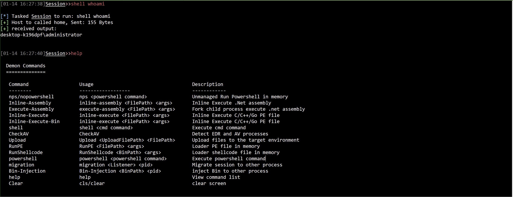
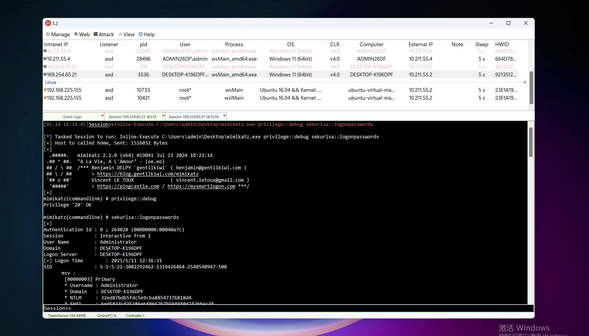
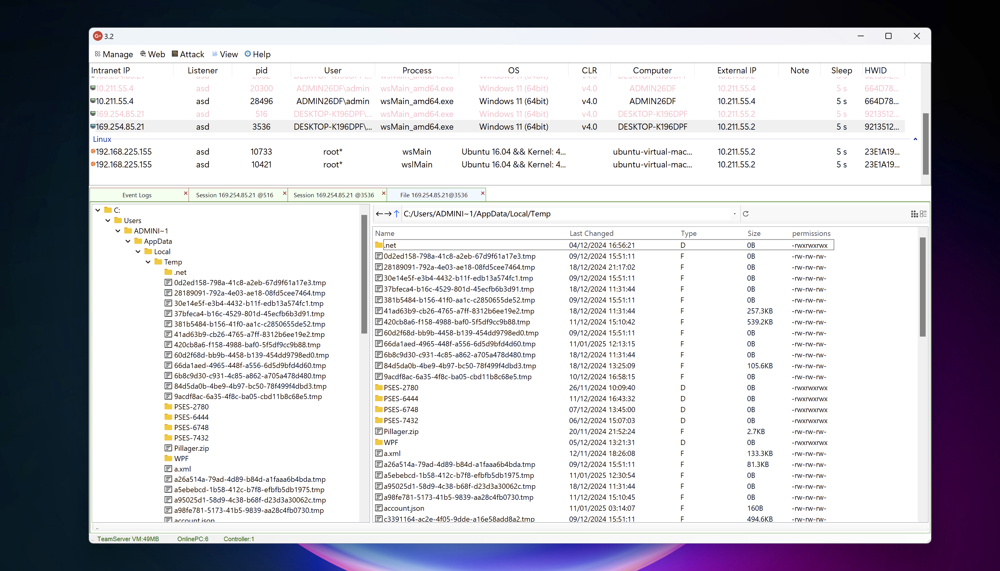
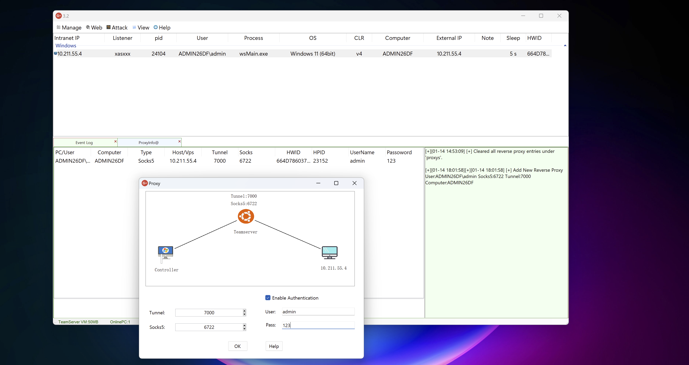
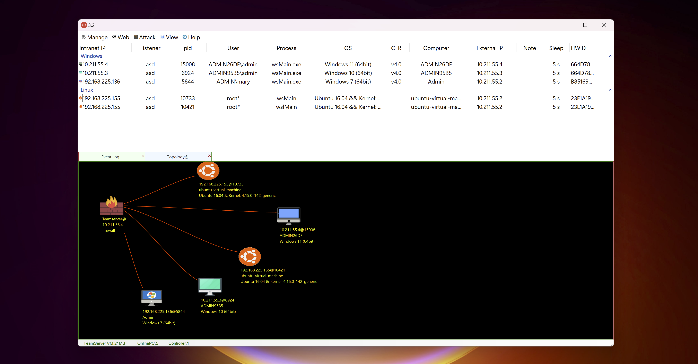
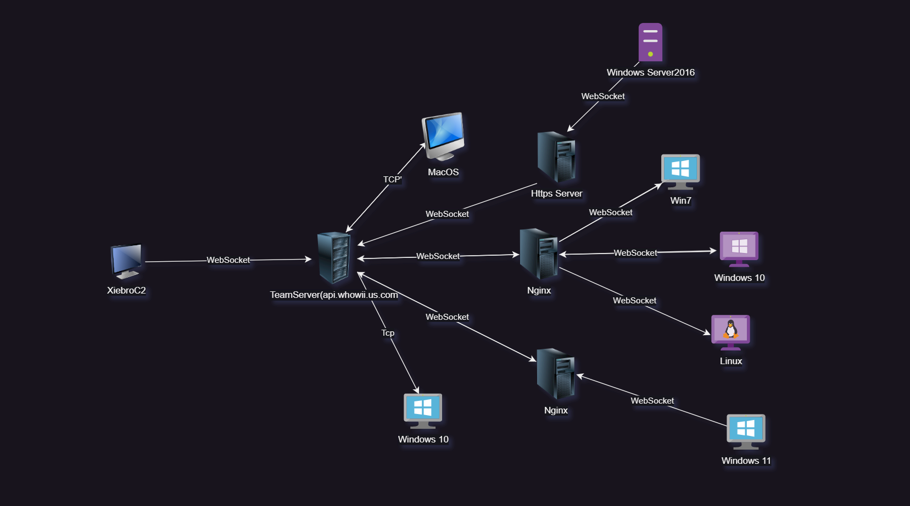

  

    
    
    
    

## 主要功能

- 植入端（Implant）使用Golang编写，兼容Windows、Linux、MacOS（移动平台正在考虑未来更新）

- 团队服务器（Teamserver）使用.net 6.0编写，不依赖.NET Core环境运行

- 控制器（Controller）支持反向shell，文件管理，进程管理，网络流量监控，内存加载，反向代理、屏幕截图、进程注入和迁移。检测AV/EDR进程，内联powershell命令

- 支持在Windows / Linux上内存中加载PE文件(inline-execute 、inline-execute-bin)

- 支持内存中执行.net程序集（execute-assembly，inline-assembly）

- 支持通过 lua 脚本扩展命令中心以及菜单栏（这一点和cna脚本类似）

- 自定义 RDI shellcode 支持（仅限 64 位，32 位需要手动客户端编译）或使用 [donut](https://github.com/TheWover/donut)、[Godonut](https://github.com/Binject/go-donut) 生成自己的 shellcode

- 通过修改profile.json中的Chat  ID、API Token参数来设置Telegram 主机上线通知

  

## 支持的平台

**Implant(Session)**

- Windows ：win7-win11，windows server2008-2022
- Linux：支持 glibc 2.17以上 的，Ubuntu、Debian、CentOS等系统
- MacOS: 10.15以上

为了考虑到兼容性，这里选择了Go 1.20进行编译

值得注意的是Go 1.20以上已经不支持win7、windows Server2008和一些古老的Linux系统了，并且XiebroC2中的payload目前只支持x64位的架构，如果你想上线更古老的系统，需要自行编译源码，并且将Go的版本降低到1.19-1.16以下

**Teamserver**

- Windows ：win8-win11，windows server2012-2022

- Linux：支持 glibc 2.17以上 的系统

## 图片展示

命令列表

内存加载Mimikatz

文件管理

反向代理

网络拓扑

通过可视化拓扑图查看网络流量分布

## 如何使用

直接使用二进制文件：[Release](https://github.com/INotGreen/XiebroC2/releases)

使用说明: [xiebroC2 Wiki](https://github.com/INotGreen/XiebroC2/wiki)

将外部的渗透测试工具扩展成Lua插件：[Xiebro-Plugins](https://github.com/INotGreen/Xiebro-Plugins)

基础教程：[观看Youtube完整视频](https://www.youtube.com/watch?v=iZpltGdu4Y4)

## Star History

## 免责声明

本项目仅用于渗透测试练习中的教育和研究目的，目前处于测试阶段。禁止将其用于任何非法活动（包括黑市交易、未经授权的渗透攻击）！互联网不是法外之地！如果您选择使用此工具，则必须遵守上述要求。

为了防止该工具被犯罪分子利用，我删除了最有害的功能，只留下一些功能作为渗透测试演练演示。Teamserver 和 Controller 不开源。

## TODO

- 考虑开发Powershell、VBscript、Hta、Jscript等payload。
- 开放更多表单和API接口，方便Lua扩展插件。
